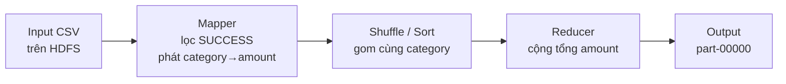

# 🛒 Hadoop MapReduce – Doanh thu thương mại điện tử theo nhóm sản phẩm

Bài thực hành Hadoop Streaming (Python) phân tích **1.500 đơn hàng tháng 09/2026** để trả lời câu hỏi:

> **Nhóm sản phẩm nào có tổng doanh thu cao nhất, chỉ tính các giao dịch `SUCCESS`?**

**Đáp án: `Electronics` – 3.703.769.311 (chiếm 76,9% doanh thu).**

---

## 📊 Thành quả

### Doanh thu theo category (đơn SUCCESS)

| Hạng | Category | Doanh thu | Tỷ trọng |
|:---:|---|---:|---:|
| 🥇 1 | **Electronics** | 3.703.769.311 | 76,9% |
| 🥈 2 | **Home** | 410.315.065 | 8,5% |
| 🥉 3 | **Fashion** | 218.597.763 | 4,5% |
| 4 | Sport | 166.194.354 | 3,5% |
| 5 | Beauty | 111.032.003 | 2,3% |
| 6 | Toy | 83.881.779 | 1,7% |
| 7 | Grocery | 80.983.147 | 1,7% |
| 8 | Book | 39.306.022 | 0,8% |
| | **Tổng** | **4.814.079.444** | 100% |

Dữ liệu: 1.240 đơn `SUCCESS`, 142 `FAILED`, 118 `RETURNED`. Top 3 chiếm **90,0%** tổng doanh thu.

### Nhận xét

1. Electronics dẫn đầu tuyệt đối với 3,70 tỷ (76,9%), gấp hơn 9 lần Home.
2. Home (410 triệu) và Fashion (219 triệu) đứng thứ 2 và 3; cả ba nhóm đầu chiếm 90% doanh thu.
3. Doanh thu tập trung vào Electronics vì giá trị mỗi đơn rất lớn (nhiều đơn hàng chục triệu đồng).
4. Vận hành nên ưu tiên tồn kho và nguồn lực giao hàng cho Electronics, đồng thời lưu ý rủi ro phụ thuộc vào một nhóm.
5. Khuyến mại nên tập trung vào Home, Fashion để cân bằng cơ cấu; Book và Grocery doanh thu thấp, cần xem lại chiến lược.
6. Chỉ tính `SUCCESS` nên con số phản ánh tiền thực thu, đã loại 142 đơn FAILED và 118 đơn RETURNED.

> ✅ Kết quả MapReduce được **đối chiếu với Pandas** (`tests/verify_with_pandas.py`) và khớp tuyệt đối.

---

## 🧠 Cách hoạt động



Bài toán tương đương SQL: `SELECT category, SUM(amount) FROM orders WHERE status='SUCCESS' GROUP BY category`.

| Giai đoạn | Việc làm | Ví dụ |
|---|---|---|
| **Mapper** (`src/mapper_revenue.py`) | Đọc từng dòng CSV, bỏ qua dòng không phải `SUCCESS`, in `category<TAB>amount` | `Electronics	12741238` |
| **Shuffle/Sort** (Hadoop tự làm) | Gom các bản ghi cùng key về cùng reducer, sắp xếp theo key | `Beauty…, Beauty…, Book…` |
| **Reducer** (`src/reducer_revenue.py`) | Vì dữ liệu đã sort, các dòng cùng key nằm liền nhau → cộng dồn, khi key đổi thì in tổng | `Electronics	3703769311` |

Điểm cần nhớ:
- Reducer dựa vào việc input **đã được sort theo key**. Nếu bỏ bước sort, một category có thể bị in nhiều lần với tổng sai.
- Dòng cuối cùng phải in riêng sau vòng lặp (`if current_key is not None`).
- **Input** nằm trong HDFS (`/user/student/ecommerce/input`), chia thành các block phân tán. **Output** là một *thư mục* (`_SUCCESS` + `part-00000`), không phải một file.
- Hadoop không cho ghi đè thư mục output: chạy lại phải xóa thư mục cũ (`hadoop fs -rm -r`).

---

## 📁 Cấu trúc project

```
hadoop-ecommerce-revenue/
├── data/orders_2026_09.csv            # dữ liệu đầu vào (1.500 đơn)
├── src/
│   ├── mapper_revenue.py              # mapper chính
│   ├── reducer_revenue.py             # reducer chính (dùng được làm combiner)
│   └── extensions/                    # phần mở rộng
│       ├── mapper_province.py         #   doanh thu theo province
│       ├── mapper_failed_rate.py      #   tỷ lệ FAILED theo channel
│       ├── reducer_failed_rate.py
│       ├── mapper_shipping.py         #   ngày giao TB theo province
│       └── reducer_avg.py
├── scripts/
│   ├── run_local.sh                   # mô phỏng pipeline trên máy local
│   ├── run_extensions_local.sh        # chạy phần mở rộng
│   └── run_hadoop.sh                  # chạy trên Hadoop thật (LabEx)
├── tests/verify_with_pandas.py        # đối chiếu với Pandas
├── results/                           # kết quả đã sinh
│   ├── result_revenue_by_category.txt
│   ├── top3.txt
│   └── extensions/
└── docs/screenshots/                  # ảnh chụp màn hình khi chạy trên Hadoop
```

Cấu trúc file CSV: `transaction_id, order_date, order_time, province, category, channel, quantity, unit_price, amount, status, shipping_days`.

---

## 🚀 Cách chạy

### A. Máy local (không cần Hadoop)

Chỉ cần Python 3. Lệnh `sort` của shell đóng vai trò Shuffle/Sort.

```bash
bash scripts/run_local.sh              # chạy MapReduce, in kết quả + top 3
bash scripts/run_extensions_local.sh   # chạy các bài mở rộng
pip install -r requirements.txt
python3 tests/verify_with_pandas.py    # đối chiếu với Pandas
```

Tương đương lệnh thủ công:

```bash
cat data/orders_2026_09.csv | python3 src/mapper_revenue.py | sort | python3 src/reducer_revenue.py
```

### B. Hadoop thật (LabEx Hadoop Practice Labs hoặc môi trường tương đương)

1. Mở Hadoop Lab có terminal, đưa project vào (upload, hoặc `git clone`, hoặc `wget`).
2. Kiểm tra môi trường: `hadoop version`, `hadoop fs -ls /`, `python3 --version`.
3. Chạy `bash scripts/run_hadoop.sh`, hoặc từng bước:

```bash
# Bước 1 – tạo thư mục HDFS và upload
hadoop fs -mkdir -p /user/student/ecommerce/input
hadoop fs -put data/orders_2026_09.csv /user/student/ecommerce/input/

# Bước 2 – kiểm tra dữ liệu
hadoop fs -ls /user/student/ecommerce/input
hadoop fs -cat /user/student/ecommerce/input/orders_2026_09.csv | head -5

# Bước 3 – chạy job Hadoop Streaming
# (tìm jar: find / -name "hadoop-streaming*.jar" 2>/dev/null)
hadoop jar $HADOOP_HOME/share/hadoop/tools/lib/hadoop-streaming-*.jar \
  -files src/mapper_revenue.py,src/reducer_revenue.py \
  -mapper  "python3 mapper_revenue.py" \
  -reducer "python3 reducer_revenue.py" \
  -input  /user/student/ecommerce/input \
  -output /user/student/ecommerce/output/revenue_by_category

# Bước 4 – xem và tải kết quả
hadoop fs -ls  /user/student/ecommerce/output/revenue_by_category
hadoop fs -cat /user/student/ecommerce/output/revenue_by_category/part-*
hadoop fs -get -f /user/student/ecommerce/output/revenue_by_category/part-* ./result_revenue_by_category.txt
sort -k2 -nr result_revenue_by_category.txt | head -3
```

### 📸 Ảnh chụp minh chứng

Đặt ảnh chụp từ Hadoop Lab vào `docs/screenshots/` rồi bỏ comment các dòng dưới:

<!--


-->

---

## 🔬 Phần mở rộng

Kết quả sinh bằng `scripts/run_extensions_local.sh`, lưu trong `results/extensions/`.

**1. Doanh thu theo province** – chỉ đổi key của mapper từ `category` sang `province`, tái sử dụng nguyên reducer.

| Province | Doanh thu |
|---|---:|
| Ho Chi Minh | 1.190.407.002 |
| Ha Noi | 1.057.988.317 |
| Khanh Hoa | 398.053.480 |

(Hai thành phố lớn chiếm khoảng 47% doanh thu; Bac Ninh thấp nhất với 86.642.293.)

**2. Tỷ lệ FAILED theo channel** – mapper phát `channel → 1/0`, reducer đếm số FAILED và tổng số đơn.

| Channel | FAILED | Tổng đơn | Tỷ lệ |
|---|---:|---:|---:|
| partner | 49 | 497 | 9,86% |
| mobile | 48 | 507 | 9,47% |
| web | 45 | 496 | 9,07% |

Chênh lệch giữa các kênh nhỏ (<1 điểm %) nên chưa đủ cơ sở kết luận kênh nào kém hơn.

**3. Số ngày giao hàng trung bình theo province** (đơn SUCCESS)

| Nhanh nhất | Ngày | Chậm nhất | Ngày |
|---|---:|---|---:|
| Ho Chi Minh | 2,55 | Lam Dong | 5,24 |
| Ha Noi | 2,62 | Can Tho | 5,04 |

Giao hàng ở hai thành phố lớn nhanh gấp khoảng 2 lần các tỉnh xa.

**4. Combiner** – thêm `-combiner "python3 reducer_revenue.py"` vào lệnh Hadoop. Vì phép cộng có tính kết hợp và giao hoán nên dùng lại reducer làm combiner được. Trên dữ liệu này, nếu một mapper xử lý toàn bộ, số dòng qua shuffle giảm **từ 1.240 xuống 8**. Với nhiều mapper thật, mỗi mapper gộp riêng phần của nó nên con số sẽ lớn hơn 8 nhưng vẫn giảm rất mạnh.
⚠️ Bài tính trung bình **không** dùng được reducer làm combiner (trung bình của các trung bình sẽ sai); phải truyền cặp `(tổng, số lượng)`.

**5. So sánh với Pandas** – `tests/verify_with_pandas.py` so khớp từng category: `OK: MapReduce == Pandas`.

**6. Small file problem (mức khái niệm)** – mỗi file nhỏ tốn một mục metadata trong bộ nhớ NameNode và thường sinh một map task riêng. Hàng nghìn file nhỏ làm job chậm hơn nhiều so với vài file lớn có cùng dung lượng. Hadoop được thiết kế cho ít file lớn.

---

## ⚠️ Lưu ý và hạn chế

- Kết quả trong repo được sinh bằng **mô phỏng local** (`cat | mapper | sort | reducer`), đúng logic với Hadoop Streaming. Ảnh chụp từ Hadoop thật cần tự bổ sung vào `docs/screenshots/`. Slide mẫu có ghi `Book 123456789…` chỉ là số minh họa, không phải kết quả thật.
- Mapper dùng `csv.DictReader` nên giả định dòng tiêu đề nằm ở đầu input. Với file nhỏ (một split) điều này đúng; với file lớn bị chia nhiều split, các split sau không có header và mapper sẽ bỏ sót dòng đầu của split đó.
- Tên và đường dẫn jar của Hadoop Streaming khác nhau tùy môi trường; script tự tìm bằng `find`.
- Thứ tự dòng trong `part-00000` là theo key (alphabet), không phải theo doanh thu. Cần `sort -k2 -nr` để lấy top.

## 🧰 Công nghệ

Hadoop (HDFS, MapReduce, Streaming) · Python 3 · Bash · Pandas (đối chiếu)
